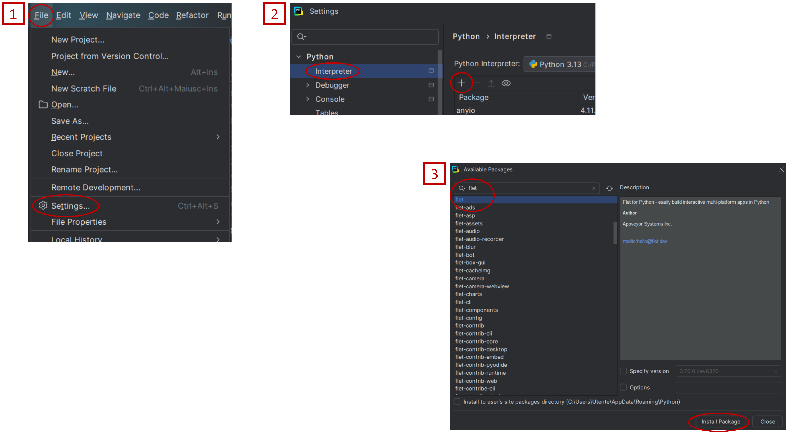
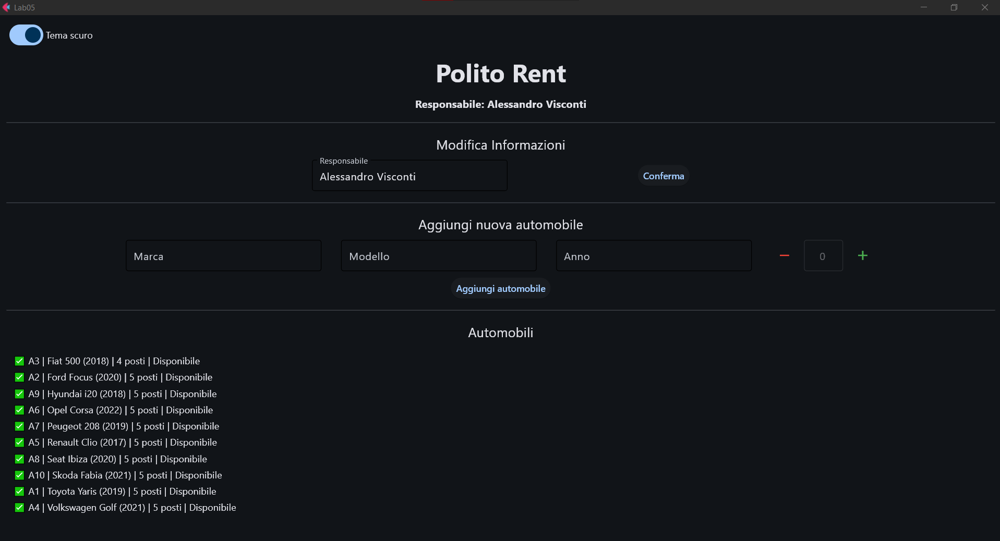

# Lab 05

#### Argomenti

- Utilizzo pacchetto `Flet` di Python (suggerita v0.28.3)

---
> **❗ ATTENZIONE:** 
>  Ricordare di effettuare il **fork** del repository principale, quindi clonare su PyCharm il **repository personale** 
> (https://github.com/my-github-username/Lab05) e non quello principale.
> 
> In caso di dubbi consultare la guida caricata nel lab02: 
> https://github.com/Programmazione-Avanzata-2025-26/Lab02/blob/main/Guida.pdf
> 

## Autonoleggio - GUI
Utilizzando `Flet`, implementare l'interfaccia grafica per la gestione dell'autonoleggio implementato 
nel Lab03.

### Materiale di Partenza
Per lo svolgimento di questo laboratorio sarà necessario utilizzare il seguente materiale di partenza già presente nel 
repository di git: 
- Codice sorgente del Lab03 (in particolare la classe `Autonoleggio` e le classi associate).
- File `automobili.csv` contenente l'elenco iniziale di automobili.

Inoltre, sarà necessario installare la libreria `flet` per la creazione di un'interfaccia.
Per installare `flet` occorre:
- Dal terminale di PyCharm, lanciare il comando: `$ pip install flet`
- Oppure usando la GUI di PyCharm e le funzionalità di installazione package: 

`File →  Settings → Python → Interpreter → + → Cercare "Flet" → Install Package`



### Implementazione
Nel file `main.py` è contenuto il codice di base da cui partire per l’implementazione dell’interfaccia grafica. 
In tale file è necessario implementare il seguente layout:



- Titolo pagina (“Lab05”) – già fatto ✅
- Pulsante per cambiare tema (default dark mode) utilizzando Switch – già fatto ✅ 
- **Sezione 1**: Intestazione Autonoleggio - già fatto ✅
  - Nome dell'autonoleggio con un controllo `Text`.
  - Nome del responsabile con un controllo `Text`.
- **Sezione 2**: Modificare il nome del responsabile - già fatto ✅
  - Un controllo `Text` con testo “Modifica Informazioni”. 
  - Un controllo `TextField` per modificare il nome. 
  - Un controllo `ElevatedButton` “Conferma” per confermare la modifica.
- **Sezione 3**: Aggiunta di Nuove Automobili - TODO 📝
  - Un controllo `Text` con testo “Aggiungi Nuova Automobile”. 
  - Aggiungere 3 controlli `TextField` per inserire marca, modello e anno. 
  - Aggiungere un contatore (esempio nelle slide dell’ultima lezione) per incrementare o decrementare il numero di posti. 
  - Aggiungere un controllo `ElevatedButton` “Aggiungi automobile” che permette di confermare l’aggiunta dell’automobile. 

    Al click del pulsante “Aggiungi automobile”, controllare che i campi numerici siano validi, aggiungere la nuova 
    automobile alla struttura dati dell'autonoleggio usando la funzione `aggiungi_automobile()` della classe `Autonoleggio`, 
    svuotare i campi `TextField` e aggiornare la lista di automobili mostrata a schermo all’interno di contenitore `ListView`. 
    
    In caso di errore (es. Valore non numerico per il campo anno), mostrare un alert usando la classe `AlertManager` nel 
    file `alert.py` già fornita nel progetto base, mediante l’istruzione `alert.show_alert(“Descrizione dell’Errore”)` 
    che farà apparire una finestra di dialogo di questo tipo: 
    
    

- **Sezione 4**: Lista delle Automobili - già fatto ✅
  - Creare un contenitore `ListView` in cui stampare l’output del metodo `automobili_ordinate_per_marca()` nella classe 
  `Autonoleggio`, una riga alla volta. 
  
  ATTENZIONE alla sintassi di `ListView`: per aggiungere del contenuto alla `ListView`, è necessario fornire come 
  ingresso al metodo `append()` un controllo e non una stringa, ad esempio: 

  ```code
  list_view = ft.ListView(expand=True, spacing=5, padding=10, auto_scroll=True)
  
  ...
  
  count = 1
  for i in range(0, 60): 
    list_view.controls.append(ft.Text(f”Line {count}”)) 
    count += 1 
  ```

Completare l’applicazione aggiungendo, oltre a quelle già presenti nel file `main.py`, tutte le funzioni di tipo 
**event handler** mancanti necessarie a collegare i componenti grafici dell’interfaccia con la logica dell’applicazione. 

